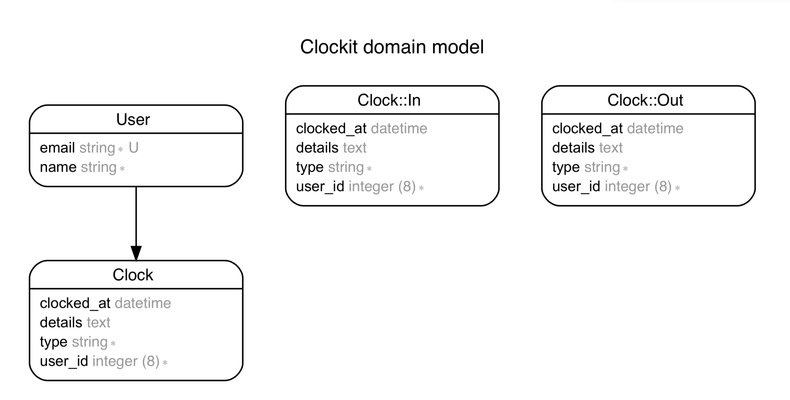

# ClockIt!

A platform that allows teachers to clock-in/clock-out of their
daycare center.

### Requirements
1. Ruby version 2.3.4
2. Rails 5.1
3. Bundler version 1.17.3

### Technology used
* Language
  1. Ruby
* Framework used
  1. Ruby on Rails
* Development and testing
  1. RSpec Rails
  2. Rubocop

### Setting up
1. clone this respository `git clone git@github.com:tomily1/ClockIt.git`.
2. Open the cloned directory with `cd ClockIt`.
3. Run `bundle install` to install dependencies
4. copy the database example in `config/database.yml.example` with `cp -v config/database.yml.example config/database.yml`.
5. create the database and run migration using `rails db:create && rails db:migrate` 

6. run server with `rails server`

### Live Demonstration

This app is available and hosted on Heroku and it is available here.

[ClockIt App Heroku](https://clock-it-hi-mama.herokuapp.com)

## Approach

After reading the requirements, I created a very simple database design shown below and it has the follow relationships:

1. User has many Clocks
2. Clock belongs to User

This enabled me to create a very basic Clocking app which can be easily improved. A user has the ability to:
1. Login or register on the app
2. View the history of clock events
3. Delete a clock event
4. Edit details of clock events

### Database diagram

### Future plans and improvement

This application is basic and it shows the basic functionality of a clocking app. However, there are improvements that can be made on the app:

If given another day to work on this:

1. I will create the admin backend that will help admin supports and application/daycare owner view all the clock in and outs of each teacher in the daycare (User Management)

2. Write more specs to increase the code coverage as well as eliminate breaking changes that might occur by introducing new features.

3. Introduce password login to ensure account security on the app.

If given a month to work on this:

1. I will introduce multitenancy to allow multiple daycares to onboard the application as well manage their teachers respectively using different subdomains and application context.

2. Improve sessions and logins by ensuring session expires, allow password reset and email confirmations.

3. Improve User management by daycare owners to allow more control over edit and delete actions for teachers clock ins and outs. i.e daycare owners can disable edit and delete actions and defined clocks as well as set automatic expiry dates to these actions. For example It won't make sense for a teacher to delete or edit a month old clock in or out, so it can be disabled.

### Author

[Tomilayo Israel](https://github.com/tomily1)
